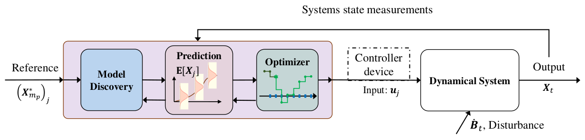
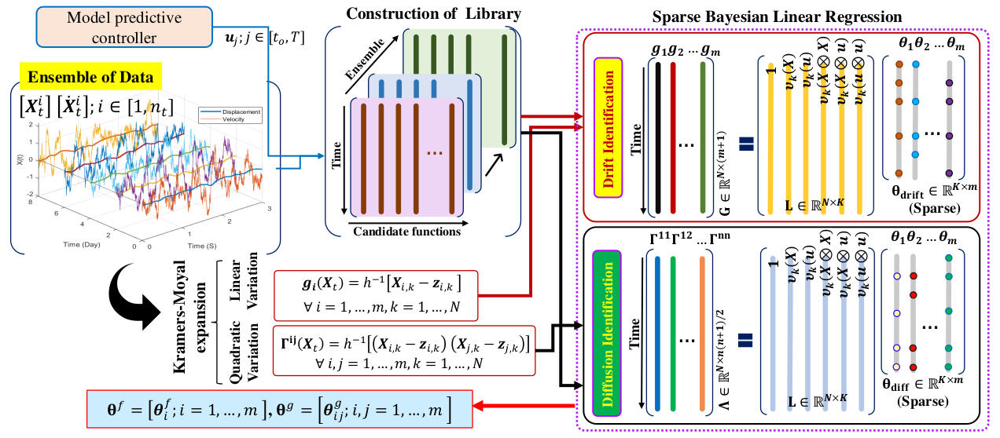
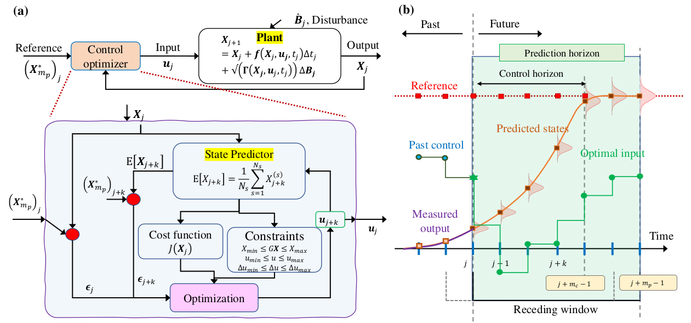

# RoMAn-Model-Predictive-Control
Robust model agnostic predictive control algorithm for randomly excited dynamical systems

This repository contains the python codes of the paper 
  > + Tripura, T., & Chakraborty, S. (2023). Robust model agnostic predictive control algorithm for randomly excited dynamical systems. Probabilistic Engineering Mechanics, 103517. [Paper](https://doi.org/10.1016/j.probengmech.2023.103517)

## Schematic architecture of the RoMAn-MPC


## The system discovery module


## The Robust control module


# Files
  + `Deterministic_codes` Contains the source codes (examples 1-3) for DT, when both noisy input-output information are available.
  + `Stochastic_codes` Contains the source codes (examples 1-3) for DT, where model updating is performed using output-only measurements.

# BibTex
If you take help of our codes, please cite us at,
```
@article{tripura2023robust,
  title={Robust model agnostic predictive control algorithm for randomly excited dynamical systems},
  author={Tripura, Tapas and Chakraborty, Souvik},
  journal={Probabilistic Engineering Mechanics},
  pages={103517},
  year={2023},
  publisher={Elsevier}
}
```
